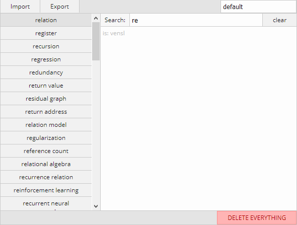

# Dictionary

A very simple dictionary web application that allows you to create as many dictionaries as you want, where you can easily create new dictionary entries and search through them.

If your dictionaries get sufficently large then this will application will start to run slow because it performs a full text search every time you press a button (when searching), and I've made no optimizations.  For small dictionaries it's quite nice.

All data is stored in the web browser in Local Storage, and you can export / import your data as JSON.

This application was written in TypeScript using React.

## Setup

Make sure you have NPM on your machine, run `npm install`, and then `npm run start` to start this application.  Open `http://localhost:3141` in a browser of your choice.

## Screenshot

## References

* [1] <https://favicon.io>
  * Where I picked up the favicon.

